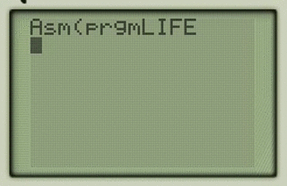

# Game of Life TI-83
Small implementation of Conway's Game of Life in Z80 assembly.
Includes Python script that generates Z80 assembly to initialize memory for:
- An initial random state. The randomness is derived from the calculator itself
  (the R register).
- A given state in `state.dat`.

